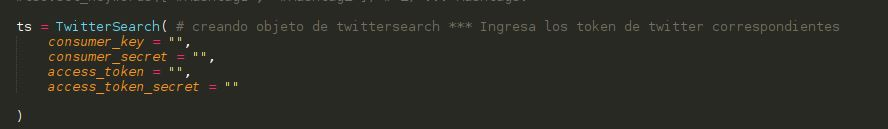
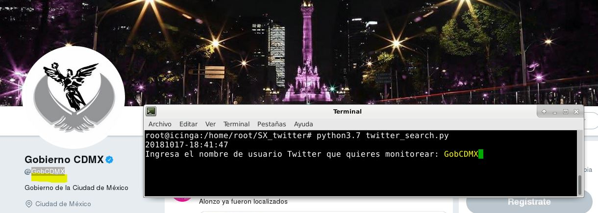
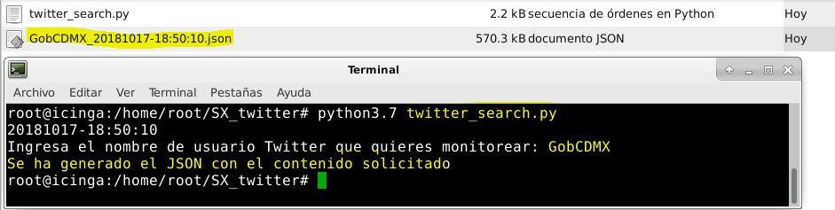
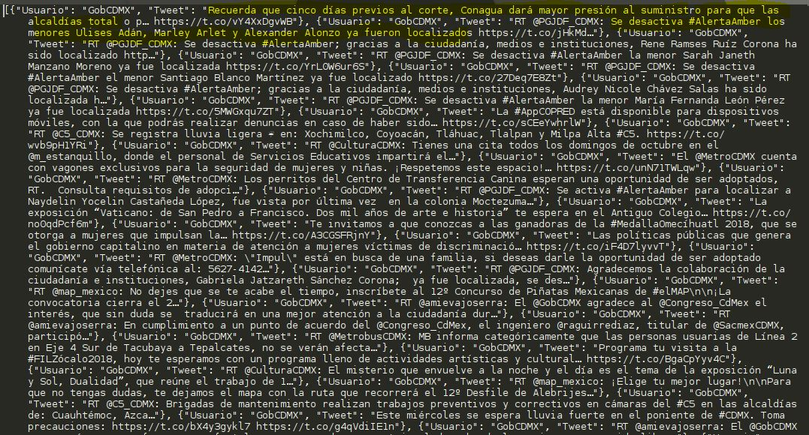

# SX_StandardAPI_Twitter

SX Standard API Twitter // Respaldo de mi cuenta anterior

Script en Python para generar un archivo JSON con los Tweets generados usando la API Standard de Twitter

<b>Dependencias:</b>

* Python 3+
* TwitterSearch

<b>Instalación y uso</b>

Solo clona o descarga el repositorio y ejecuta el archivo python, te pedirá ingresar el nombre del usuario de Twitter al que deseas descargar los tweets de su timeline.

También puedes realizar el filtro por Hashtag (comentado en el código).
Se incluye un archivo de apoyo en caso que requieras instalar Python 3 en tu sistema Linux, así como otros datos que pueden ser de tu interés.

<b>Agregar el token de tu cuenta</b>

<b>Ejemplo de usuario de twitter</b>

<b>Ejemplo de archivo generado</b>

<b>Comparando el JSON con el timeline</b>

https://developer.twitter.com/en.html
